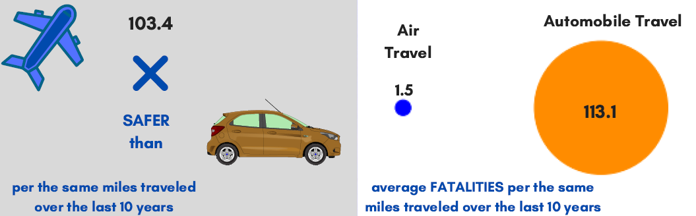

## Data Visualization
**Summary**

This project was a class project for the data visualization course.  The goal was to effectively tell a story with data to different types of audiences.  The topic was to examine airline safety data, determine how safe current airline travel is, and tell the story to an internal data science audience, internal executive audience, and to an external audience via a blog, an infographic, and a presentation.

**Tools**

* Tableau
* PowerBI
* Matplotlib
* Seaborn
* Plotly
* Numpy
* Pandas

## Project Preview

**Executive Audience**

**Public Audience:  Blog**

**Public Audience:  Infographic**

**Public Audience:  Presentation**

